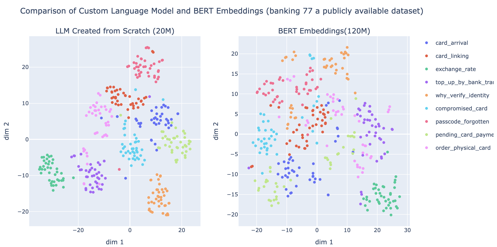

# Custom Language Model Builder

Repo for tutorial on creating a language model from scratch:  https://substack.com/inbox/post/143369064. It includes scripts for training a tokenizer, setting up a transformer encoder, and running the training process on your dataset.

## Features

- **Custom Tokenizer Training**: Train a byte pair encoding (BPE) tokenizer training to adapt the custom vocabulary to your specific domain. You can also add your special tokens there.
- **Encoder-Only Transformer Model**: Implements a custom transformer encoder to get embeddings for each tokens. Based on your data, you can different number of heads and layers, which means you have a full control over your model size.

## Directory Structure

- **data/**: contains training and test datasets in plain text format.
- **resources/**: Includes the trained tokenizer file (`bpe_tokenizer_banking77.json`), 
- **main.py**: main training script for the language model.
- **preprocessing.py**: Script to preprocess raw text data before feeding it to the model. Make sure you add your special tokens there if you want any.
- **train_tokenizer.py**: Script to train the custom tokenizer.
- **transformer_model.py**: Custom transformer encoder model.

## Setup

1. Clone the repository and navigate to the project directory.
   ```bash
   git clone https://github.com/AliLotfi92/LangModelBuilder.git
   cd LangModelBuilder
   ```

2. Install the required dependencies:
   ```bash
   pip install -r requirement.txt
   ```

3. Make sure your dataset is in the `data/` directory. I used banking 77 dataset `data/banking77_corpus.txt` as the training corpus.

## Usage

### 1. Train the Tokenizer

To train a new tokenizer, use `train_tokenizer.py`. The trained tokenizer file will be saved in the `resources/` directory.

### 2. Train the Language Model

To train the language model, run `main.py`:
```bash
torchrun --nproc_per_node=4 main.py
```

The `main.py` script includes:
- **Tokenization**: Uses a the custom trained tokenizer from `resources/bpe_tokenizer_banking77.json`.
- **Dataset Preparation**: Dynamic Masking self supervised dataset using `LineByLineTextDataset`.

**Note** you can easily add  `mlflow` to monitor the training process or for version controlling 


## Configuration

You can adjust the following parameters in `main.py`:
- `block_size`: Sets the maximum token length for input sequences.
- `mlm_prob`: Specifies the masking probability for MLM tasks.
- `batch_size`: Adjust batch size in the `DataLoader` for efficient training.
- `vocab_size`: Set the tokenizer vocabulary size during training.

## Why Pretrain Your Custom Language Model

Want to see the difference between your custom model (not using labels) and Pretrained BERT?

Using your custom LM embeddings, you can review the quality of your labels for your downstream task. Please note that I have not leveraged the labels in training at all.   



## Contributing

Feel free to contribute to this repository.
